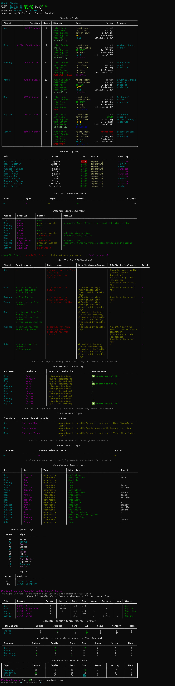

hor-tools
=========

Read Morinus `.hor` files, normalize chart data, and compute placements with Swiss Ephemeris (pyswisseph). Uses Whole sign houses by default and is built to be extended with Lots and export formats later.

Preview
-------


Requirements
------------
- Python 3.11+
- uv (https://github.com/astral-sh/uv) installed and on PATH
- Swiss Ephemeris data files (see below)

Setup
-----
```bash
# From repo root (astro_data)
uv sync
```

Ephemeris data
--------------
Swiss Ephemeris data files are required (planet/moon `.se1` files and `sefstars.txt` for fixed stars); they are not bundled. Download the ephemeris from the official source (e.g. https://www.astro.com/ftp/swisseph/ephe/) and point the tool at the folder either via `SWISSEPH_EPHE` or `--ephe`. No machine-specific default is assumed.
```bash
export SWISSEPH_EPHE=/path/to/ephemeris
# or per-run
uv run hor-reader --ephe /path/to/ephemeris sample_chart.hor
```
Place the directory anywhere (e.g., `~/.local/share/swisseph` on Linux) and set the variable before running. If the path is missing, the CLI will raise a clear error telling you to set it.

Usage
-----
```bash
# From repo root (astro_data)
uv run hor-reader sample_chart.hor

# Point at any Morinus .hor file
uv run hor-reader path/to/file.hor

# Use a specific ephemeris directory (overrides SWISSEPH_EPHE)
uv run hor-reader --ephe ~/projects/MorinusWin/SWEP/Ephem sample_chart.hor

# HTML/Markdown exports now go to ./outputs/ by default when relative paths are used
uv run hor-reader path/to/file.hor --html report.html --md report.md
# writes outputs/report.html and outputs/report.md
```

What you get
------------
- Chart header at the top of every report (console/HTML/Markdown): name, local time (with UTC offset), UTC time, location, house system, zodiac.
- Parsed chart input (UTC datetime, decimal lat/lon, tz offset stored).
- Planet positions (Sun through Saturn) via Swiss Ephemeris, mapped to Whole sign houses.
- Derived Whole sign house cusps plus Ascendant/MC.
- Traditional analysis bundle per planet: dignities, sect/hayz/halb, motion class, synodic phase, fixed stars, and aspect flags (applying/separating, dexter/sinister, mutual application/separation, counter-rays).
- Antiscia + contra-antiscia reflection points with detected planet contacts (degree-sum rule, no orbs).
- Domicile sight / aversion: whether a planet “sees” its own domiciles by sign; aversion can be avoided via translation of light to a planet in its domicile or by being in an antiscia/contra-antiscia sign to that domicile.
- Relationship layers: domination/decimation (with aktinobolia), bonification/maltreatment sources, benefic/malefic enclosures, receptions/generosities, translations/collections of light (with natural-speed notes), feral planet marker.
- Rich console tables with dark HTML/markdown export; Almuten tables included.
- CLI/text, HTML, and Markdown share the same renderer; when you change the console layout in code, it automatically carries through to HTML/MD.

Project layout
--------------
- Repo root (now `astro_data/`):
  - `pyproject.toml`, `uv.lock`
  - `hor_tools/` (package)
  - `docs/img/` (screenshots for the README)
  - `tests/`
  - `context.md` (architecture overview)
  - Personal `.hor` files (git-ignored) can sit alongside.
- Entry point: `hor_tools/cli.py` (`hor-reader`).
- Core modules: `models.py`, `hor_parser.py`, `astro_engine.py`, `analysis/*`, `output.py`.
- Helpers:
  - `scan_events.py`: list ingresses and exact aspects in a date range (see below).
  - `asc_window_scan.py`: generate reports for each Ascendant change in a window.

Extending
---------
- Configure ephemeris path in `astro_engine.py` (`EPHE_PATH` constant).
- Add Lots, aspects, dignities, or additional bodies in `astro_engine.py`.
- Relationship logic lives in `analysis/relationships.py`; aspect helpers in `analysis/aspects.py`.
- Implement exports in `output.py` (XLSX via `openpyxl`, DOCX/ODT via `python-docx` or `odfpy`).

For maintainers: publish & install elsewhere
--------------------------------------------
1) Publish to GitHub (once):
```bash
git init
git add .
git commit -m "Initial import of hor-tools"
gh repo create yourname/hor-tools --source=. --public --push  # or create on GitHub and git remote add origin ...
git push -u origin main
```

2) Install and run on another Linux/Mac machine (with uv installed):
```bash
git clone https://github.com/yourname/hor-tools.git
cd hor-tools
uv sync
export SWISSEPH_EPHE=/path/to/ephemeris  # set to your Swiss Ephemeris folder
uv run hor-reader path/to/file.hor --html report.html --md report.md
```

Helper scripts
--------------
**Ingresses + aspects (scan_events.py)**
```
uv run scan_events.py \
  --start "2028-01-01T00:00:00Z" \
  --end "2028-02-01T00:00:00Z" \
  --lat 40.7 --lon -74.0 \
  --step-min 60 --tol-min 0.1 \
  --aspect 0=conj --aspect 60=sextile --aspect 90=square --aspect 120=trine --aspect 180=opp
```
Lists every sign ingress and exact aspect hit (Sun–Saturn). Accepts custom aspects and an optional `--ephe` path.

**Ascendant window scan (asc_window_scan.py)**
```
uv run asc_window_scan.py \
  --primer path/to/template.hor \
  --start-date 2028-04-20 --end-date 2028-05-05 \
  --window-start 12:00 --window-end 18:00 \
  --step-min 10 --tol-min 0.2
```
- Uses the primer `.hor` for location/tz/house/zodiac; iterates through the date window and daily time window to find every Ascendant sign change.
- Writes a consolidated Markdown report to `outputs/asc_scan_<start>_<end>.md` by default and prints the file path.
- Default output is lightweight (no Almuten tables); add `--verbose` to include full reports with Almuten.
- Set `--out myfile.md` to control the output path (relative paths go under `outputs/`).
