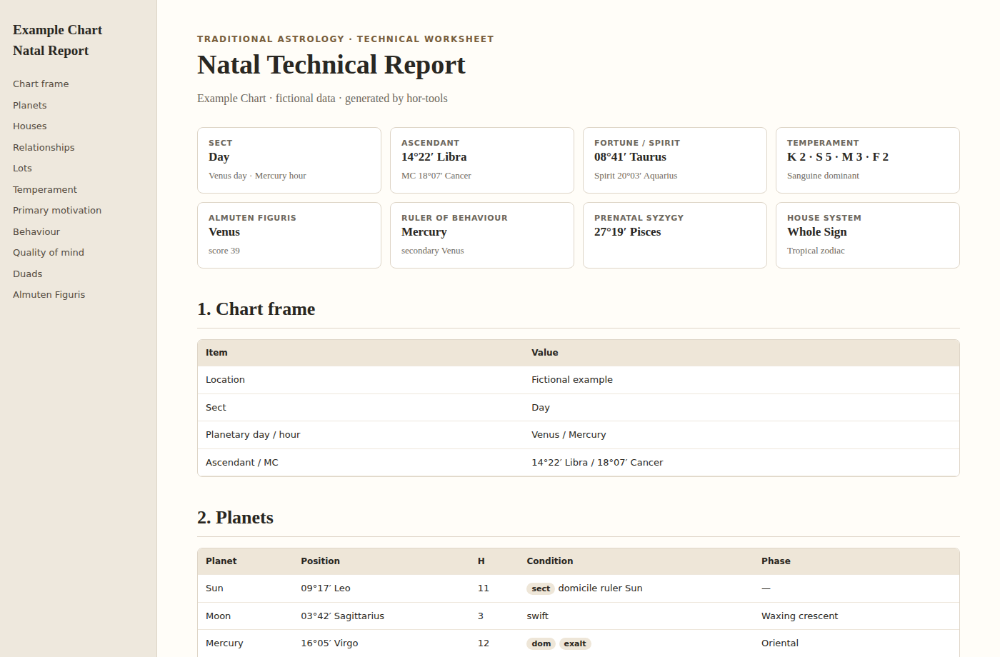

# hor-tools

[](https://github.com/Cybergnostic/astro_data/actions/workflows/ci.yml)

`hor-tools` is a Traditional Astrology calculation and reporting toolkit built around classic Morinus `.hor` files and Swiss Ephemeris.

It is designed as a **technical worksheet generator for the astrologer**, not as an automatic natal-reading engine. The program calculates the parts that can be reproduced reliably from explicit rules and exposes the evidence for areas that still require astrological judgment.

The project currently uses:

- Sun through Saturn only
- Tropical zodiac
- Whole Sign houses for house placement
- Swiss Ephemeris for astronomical positions and angles
- course/project traditional rules and the teacher-configured Morinus Almuten setup



## Current output

`hor-reader` now has three levels of presentation:

1. **Terminal** — compact working snapshot for quick chart inspection.
2. **Markdown** — complete technical worksheet, generated automatically.
3. **HTML** — complete responsive report with navigation, cards, tables, collapsible technical detail, mobile layout, and print CSS.

Sample generated reports are included in the repository:

- [Jovan — Markdown report](outputs/jovan.md)
- [Jovan — HTML report](outputs/jovan.html)

The reports are generated from the same calculation model. Presentation code does not decide astrological doctrine.

## Requirements

- Python 3.11+
- [`uv`](https://docs.astral.sh/uv/)
- Swiss Ephemeris data files

## Setup

```bash
cd astro_data
uv sync --all-groups
```

Point the program at your Swiss Ephemeris directory with either `SWISSEPH_EPHE` or `--ephe`:

```bash
export SWISSEPH_EPHE=~/.local/share/swisseph

# or per command
uv run hor-reader --ephe ~/.local/share/swisseph chart.hor
```

The configured directory must exist. Fixed-star work additionally depends on the Swiss fixed-star catalogue available to pyswisseph, normally `sefstars.txt` in the ephemeris directory.

## Everyday use

The normal command is:

```bash
uv run hor-reader chart.hor
```

This prints the compact terminal summary and automatically writes:

```text
outputs/chart_report.md
```

Generate HTML as well:

```bash
uv run hor-reader chart.hor --html chart.html
```

A simple relative filename is written under `outputs/`, so this creates:

```text
outputs/chart.html
outputs/chart_report.md
```

Choose an explicit Markdown name:

```bash
uv run hor-reader chart.hor --md chart.md
```

Skip Markdown when only terminal/HTML output is wanted:

```bash
uv run hor-reader chart.hor --html chart.html --no-md
```

Show the old full terminal tables after the compact snapshot:

```bash
uv run hor-reader chart.hor --verbose-terminal
```

Other useful commands:

```bash
uv run hor-reader --help
uv run hor-reader --version
uv run hor-reader chart.hor --debug
```

The CLI uses normal `argparse` validation. Unknown options, missing values, multiple input files, malformed `.hor` files, and invalid ephemeris paths fail explicitly rather than being silently guessed.

## What is calculated

### Chart frame

- normalized UTC datetime and Morinus location data
- Ascendant and MC
- Whole Sign houses
- true-horizon chart sect
- apparent sunrise/sunset data for planetary-hour division
- planetary day and planetary hour
- prenatal syzygy

### Planetary state

- Sun through Saturn longitudes, latitude, speed, and house
- domicile, exaltation, Dorothean triplicity, Egyptian terms, Chaldean faces
- detriment and fall
- planetary sect, Hayz, Halb
- oriental/occidental condition
- direct/retrograde motion, station state, and speed relative to mean motion
- solar/synodic phases
- ordinary cazimi and stricter longitude+latitude true cazimi
- Via Combusta, joys, latitude testimony, lunar void-of-course
- course fixed-star conjunctions with magnitude-sensitive rules

### Aspects and relationships

- major aspects using the project/teacher planetary orbs
- applying/separating geometry
- dexter/sinister
- mutual application/separation and counter-rays
- antiscia and contra-antiscia
- domicile sight and aversion
- domination/decimation and aktinobolia
- bonification/maltreatment
- benefic/malefic enclosure
- reception
- generosity
- repulsion (`odbojnost`)
- translation and collection of light
- feral condition

### Derived points and natal calculations

- duads / dodekatemoria
- seven Hermetic Lots
- supported topical Lots
- sex-specific Hermes marriage Lot from the Morinus header
- conditional Father Lot rule
- Lot rulers, ruler sight, and planetary contacts to Lots
- temperament worksheet and totals
- primary-motivation factors
- algorithmic Ruler of Behaviour selection where the rules are decisive
- unresolved Behaviour candidates when the course requires qualitative comparison
- Quality-of-Mind factors for Mercury and Moon
- individual degree almutens and composite Almuten of Mind
- Ruler-of-Geniture evidence without a fake numerical verdict
- Almuten Figuris

### Almuten Figuris

The Almuten calculation follows the teacher-configured Morinus setup used by this project:

- Sun, Moon, Ascendant, Fortune, and prenatal syzygy as the five life points
- essential weights `5 / 4 / 3 / 2 / 1`
- all three Dorothean triplicity rulers
- Mercury exaltation in Virgo
- teacher-configured house scores, including VIII = 4 and IX = 5
- day ruler `+7`
- hour ruler `+6`
- Morinus directional superior-planet phase bands `18–30 / 30–40 / 40–80 / 80–100 / 100–120` with scores `1 / 2 / 3 / 2 / 1`

## Calculation vs. astrological judgment

The program deliberately does **not** pretend that every natal technique can be reduced to an algorithm.

It calculates deterministic evidence for techniques such as Primary Motivation, Quality of Mind, and Ruler of Geniture, but leaves the final synthesis to the astrologer where the course itself requires judgment.

It does not automatically produce final judgments for areas such as:

- physical appearance
- triplicity life divisions
- final Ruler-of-Geniture selection when qualitative comparison is required
- complete psychological synthesis of Primary Motivation
- complete interpretation of Quality of Mind
- topic-specific natal judgments such as marriage, career, children, etc.

This separation is intentional.

## Morinus `.hor` support

The parser targets the classic Morinus protocol-0 natal/radix header used by the project. It validates the serialized fields rather than scanning arbitrary integers.

Preserved input data includes:

- chart name
- native sex field when present
- place name
- longitude and latitude
- altitude
- civil UTC offset
- normalized UTC datetime

Supported time forms:

- Gregorian calendar
- zone/civil time with east/west UTC offset and Morinus DST flag
- Greenwich time
- local mean time

Explicitly rejected rather than approximated:

- BC charts
- Julian-calendar `.hor` dates
- local apparent time

Invalid or incomplete coordinates raise an error; the parser never silently falls back to `0°N, 0°E`.

## Scanner commands

### Ingresses and exact aspects

```bash
uv run hor-scan-events \
  --start "2028-01-01T00:00:00Z" \
  --end "2028-02-01T00:00:00Z" \
  --lat 40.7 --lon -74.0 \
  --step-min 60 --tol-min 0.1 \
  --aspect 0=conj \
  --aspect 60=sextile \
  --aspect 90=square \
  --aspect 120=trine \
  --aspect 180=opp
```

The event scanner uses a lightweight longitude-only ephemeris path and does not recalculate houses, stations, or synodic state during every refinement step. `--step-min` and `--tol-min` must be positive.

### Ascendant-window scanner

```bash
uv run hor-scan-asc \
  --primer path/to/template.hor \
  --start-date 2028-04-20 \
  --end-date 2028-05-05 \
  --window-start 12:00 \
  --window-end 18:00 \
  --step-min 10 \
  --tol-min 0.2 \
  --tz Europe/Belgrade
```

- The primer supplies chart location and metadata.
- Prefer an IANA timezone with `--tz` across DST transitions.
- Without `--tz`, the fixed civil offset stored in the `.hor` file is used and a warning is printed.
- Overnight daily windows are not currently supported.
- Output defaults to `outputs/asc_scan_<start>_<end>.md`.
- `--verbose` includes full reports with Almuten tables.

The old root commands `uv run scan_events.py ...` and `uv run asc_window_scan.py ...` remain compatibility wrappers.

## Project layout

```text
hor_tools/
    cli.py                  main hor-reader command
    hor_parser.py           validated Morinus parser
    astro_engine.py         Swiss Ephemeris / raw astronomy
    models.py               normalized chart/report dataclasses
    almuten.py              Almuten calculations
    almuten_types.py        typed Almuten result objects
    synodic.py              solar/synodic state logic

    analysis/
        aspects.py
        dignity.py
        duads.py
        lots.py
        natal_synthesis.py
        relationships.py
        sect.py
        solar.py
        stars.py
        technical.py
        temperament.py
        ...

    rendering/
        pretty_report.py    polished Markdown + HTML reports
        technical.py        compact terminal technical summary
        almuten.py
        relationships.py

    commands/
        scan_events.py
        asc_window.py

tests/
    fixtures/               representative Morinus inputs

outputs/
    jovan.md                tracked example Markdown report
    jovan.html              tracked example HTML report

.github/workflows/ci.yml    lint + tests + build + clean-wheel smoke test
```

`context.md` contains maintainer-oriented architecture notes and domain boundaries.

## Development

Install development dependencies:

```bash
uv sync --all-groups
```

Run lint and tests:

```bash
uv run ruff check hor_tools tests scan_events.py asc_window_scan.py
uv run pytest -q
```

Build the package:

```bash
uv build
```

CI also installs the built wheel into a clean virtual environment, imports the important subpackages, and smoke-tests all three console commands. This catches packaging problems that an editable source checkout can hide.

## Project status

The core calculation layer has undergone a source-by-source audit against the project course material and the teacher-configured Morinus behavior, with regression tests added for the important edge cases found during that audit.

Future changes to presentation or architecture should not silently alter astrological rules. New doctrine should be implemented only when its source rule is explicit enough to reproduce and test.
